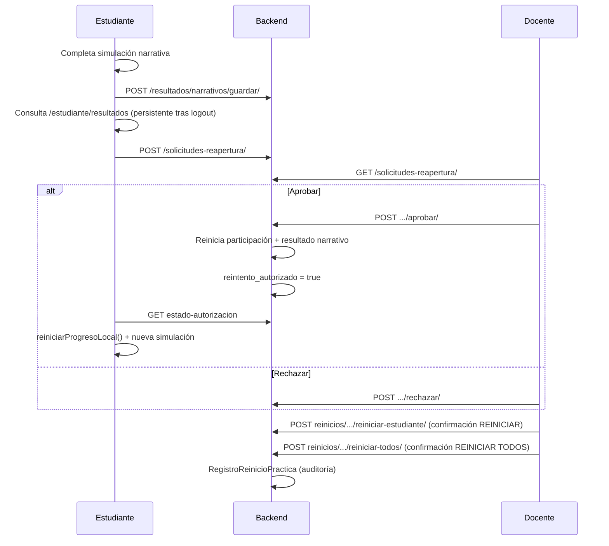

# FASE 13 — Estabilidad de sesión, reintentos y resultados académicos

Documentación de entrega para la Fase 13 del Simulador de Decisiones Psicosociales.

---

## 1. Causa del problema de redirección post-login

### Diagnóstico

Tras un login exitoso, `AuthService.handleAuthSuccess()` y `EstudianteSessionService.registrarAcceso()` escribían tokens en `localStorage` y actualizaban signals (`_usuario`, `_practicas`), pero los **guards** consultaban:

- `AuthService.isAuthenticated` → `computed()` que leía `localStorage` **sin depender de ningún signal**
- `EstudianteSessionService.autenticado` → mismo patrón

En Angular, un `computed()` solo se recalcula cuando cambian sus **dependencias signal**. Como `localStorage` no es reactivo, el valor quedaba cacheado en `false` desde el arranque de la app.

**Flujo del bug:**

1. App inicia sin sesión → `isAuthenticated()` = `false` (cacheado)
2. Login escribe tokens → `_usuario.set(...)` actualiza `rol()` correctamente
3. `router.navigateByUrl('/docente')` ejecuta `authGuard` → `isAuthenticated()` sigue en `false`
4. Guard redirige a `/auth` → el usuario permanece en login
5. F5 re-evalúa los computeds con tokens ya presentes → guards pasan

### Corrección aplicada

**`auth.service.ts`:** `isAuthenticated` ahora lee `this._usuario()` para establecer dependencia reactiva.

**`estudiante-session.service.ts`:** Se añadió `_sesionActiva` signal, actualizado en `registrarAcceso()` y `cerrarSesion()`. `autenticado` depende de esa signal. También `_practicaActivaId` para `practicaActiva`.

---

## 2. Cambios backend

### Nuevos modelos

| Modelo | App | Descripción |
|--------|-----|-------------|
| `SolicitudReapertura` | practicas | Solicitud estudiante → docente |
| `RegistroReinicioPractica` | practicas | Auditoría de reinicios |
| `ResultadoNarrativo` | resultados | Resultado académico persistente de simulación narrativa |

### Nuevos servicios

- `apps/practicas/reintento_services.py` — crear/aprobar/rechazar solicitudes, reinicio individual/global
- `apps/resultados/narrativo_services.py` — guardar resultado y generar retroalimentación automática

### Migraciones

- `practicas/migrations/0005_fase13_reintentos_resultados.py`
- `resultados/migrations/0003_fase13_resultado_narrativo.py`

**Aplicar en servidor:**

```bash
python manage.py migrate practicas resultados
```

---

## 3. Cambios frontend

### Bloque 1 — Autenticación

| Archivo | Cambio |
|---------|--------|
| `core/auth/auth.service.ts` | `isAuthenticated` reactivo |
| `core/services/estudiante-session.service.ts` | `_sesionActiva`, `reiniciarProgresoLocal()` |
| `core/simulacion-narrativa/utils/partida-persistencia.util.ts` | `borrarPartidaPersistida()` (solo para reinicios docente) |

### Bloque 2 — Solicitud de reintento

| Archivo | Cambio |
|---------|--------|
| `estudiante/practica-info/*` | Botón «Solicitar nuevo intento», sync estado API |
| `solicitudes-reapertura/*` | Panel docente: listar, aprobar, rechazar |
| `core/services/practicas.service.ts` | Métodos API solicitudes |

### Bloque 3 — Reinicio masivo

| Archivo | Cambio |
|---------|--------|
| `reinicio-practicas/*` | Reinicio individual y global con confirmación |
| Rutas `/reinicio-practicas` (solo docente) | |

### Bloque 4 — Resultados

| Archivo | Cambio |
|---------|--------|
| `estudiante/resultados-retroalimentacion/*` | Sección estudiante (flujo código) |
| `panel-estudiante/resultados.*` | Sección estudiante JWT |
| `core/services/resultados-narrativos.service.ts` | Cliente API |
| `estudiante/simulacion-narrativa/simulacion-narrativa.ts` | Sync resultado al completar (sin alterar persistencia local de partida) |

### Navegación

- Estudiante (código): `/estudiante/resultados`
- Estudiante (JWT): `/panel-estudiante/resultados`
- Docente: `/solicitudes-reapertura`, `/reinicio-practicas`

---

## 4. Nuevas tablas y endpoints

### Tablas

- `practicas_solicitudreapertura`
- `practicas_registroreiniciopractica`
- `resultados_resultadonarrativo`

### Endpoints

| Método | Ruta | Rol | Acción |
|--------|------|-----|--------|
| GET | `/api/practicas/solicitudes-reapertura/` | Estudiante/Docente/Admin | Listar solicitudes |
| POST | `/api/practicas/solicitudes-reapertura/` | Estudiante | Crear solicitud |
| POST | `/api/practicas/solicitudes-reapertura/{id}/aprobar/` | Docente/Admin | Aprobar y reiniciar |
| POST | `/api/practicas/solicitudes-reapertura/{id}/rechazar/` | Docente/Admin | Rechazar |
| POST | `/api/practicas/reinicios/{practica_id}/reiniciar-estudiante/` | Docente/Admin | Reinicio individual |
| POST | `/api/practicas/reinicios/{practica_id}/reiniciar-todos/` | Docente/Admin | Reinicio global |
| GET | `/api/practicas/reinicios/registros/` | Docente/Admin | Auditoría |
| GET | `/api/practicas/reinicios/estado-autorizacion/` | Estudiante | Estado reintento |
| GET | `/api/resultados/narrativos/mis-resultados/` | Estudiante | Mis resultados |
| POST | `/api/resultados/narrativos/guardar/` | Estudiante | Persistir resultado narrativo |
| GET | `/api/resultados/narrativos/{id}/` | Todos (scoped) | Detalle |

---

## 5. Permisos añadidos

- **Estudiante:** crear solicitud, consultar propias solicitudes, guardar/consultar resultados narrativos, consultar estado de autorización
- **Docente:** listar/aprobar/rechazar solicitudes de sus prácticas, reiniciar individual/global, ver registros de auditoría
- **Admin:** mismos permisos que docente sobre todas las prácticas

Reinicio global e individual: **solo docentes** (admin incluido en solicitudes; reinicio-practicas route restringida a `Rol.Docente` en frontend).

---

## 6. Flujo completo estudiante ↔ docente



---

## 7. Validación realizada

| Verificación | Resultado |
|--------------|-----------|
| Build frontend (`ng build`) | Compila correctamente (warnings de budget preexistentes) |
| Fix auth signals | `isAuthenticated` y `autenticado` invalidan tras login |
| Rutas registradas | app.routes, estudiante.routes, panel-estudiante.routes |
| Migraciones creadas | 0005 practicas, 0003 resultados |
| No modificado | narrativa, diálogos, hotspots, fullscreen, comisaría, persistencia de partida durante simulación |

### Pruebas manuales recomendadas

1. Login docente/admin/estudiante → redirección inmediata sin F5
2. Completar práctica → ver resultado en «Resultados y retroalimentación»
3. Cerrar sesión y volver → resultados siguen visibles (API)
4. Solicitar reintento → docente aprueba → estudiante puede reiniciar
5. Docente reinicia individual/global → registro en auditoría

---

## Archivos no modificados (según restricciones)

- Contenido narrativo, diálogos, hotspots
- `fullscreen.service.ts` y lógica de pantalla completa
- Escenas/comisaría
- Mecanismo de persistencia de partida durante la simulación (`partida-persistencia.util` solo añade `borrarPartidaPersistida` para reinicios académicos)
